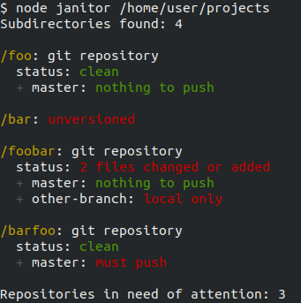

# Janitor

Janitor is a tool to report status of several git repositories at once. For each repository, it reports working directory status as well as the situation of each local branch.

I made this because I had dozens of folders in a hard drive which was about to be formatted and I wanted to know if there were any changes in my projects that were not uploaded to the could yet.

## How to install

Janitor needs [Node.js](https://nodejs.org) v7.6 or higher to run. To install Node.js, either refer to the official docs or, even better, use `nvm` by following the steps [here](https://github.com/creationix/nvm).

To install Janitor:

    git clone git@github.com:luciopaiva/janitor.git
    cd janitor
    npm install

## How to run

    node janitor <PATH_TO_FOLDER_WITH_GIT_REPOSITORIES> [--no-color]

Given the following folder structure as an example:

    /home/user/projects
      |-> /foo
      |-> /bar
      |-> /boo
      |-> /far
      |-> /foobar
      |-> /barfoo
      |-> /boofar

Here's Janitor's output:

    $ node janitor /home/user/projects --no-color
    Subdirectories found 7:

    > foo: unversioned
    ----------------------------------------
    > bar: git repository
      status: clean
      > master nothing to push
    ----------------------------------------
    > boo: git repository
      status: clean
      > master nothing to push
    ----------------------------------------
    > far: git repository
      status: 1 file changed or added
      > master nothing to push
    ----------------------------------------
    > foobar: git repository
      status: 2 files changed or added
      > master must push
    ----------------------------------------
    > barfoo: git repository
      status: clean
      > master nothing to push
    ----------------------------------------
    > boofar: git repository
      status: clean
      > master nothing to push
      > other-branch local only
    ----------------------------------------

For each folder, Janitor checks if it is a git repository or not. For folders with no repository, "unversioned" will be printed. For git repositories, the line "status" reports current working directory status. It can be either "clean" or tell how many files are modified and need to be committed (and will also warn about eventual conflicts).

Following that comes a list of local branches and their statuses. Branches can be marked as

- nothing to push: no need to worry about this branch
- must push: there are local commits that were not pushed to the remote repository
- local only: branch only exists locally
